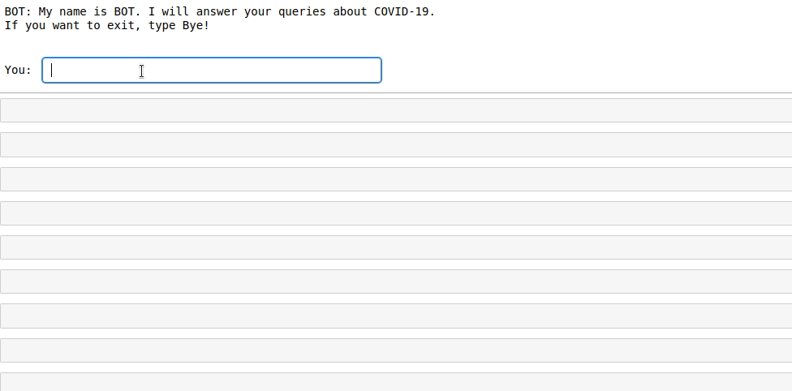
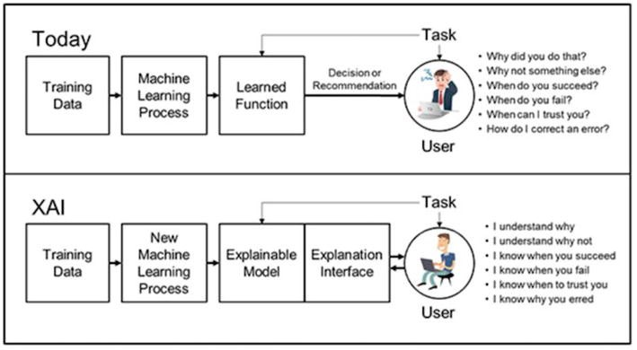

# Robokalam_Assignment
## Internship Role: AI and ML

> [Task1](#task1) | [Task2](#task2) | [Task3](#task3) | [Tech Stack](tech-stack)


# Task1

## NLP based chatbot

A simple retrieval based chatbot which resolves the queries on COVID-19. 
The data is given in such a way that it can answers all the basic questions on COVID-19.
Data was taken from [wikipedia](https://en.wikipedia.org/wiki/Coronavirus_disease_2019)

### Requirements
- nltk
```
$ pip install nltk
```
- scikit-learn
```
$ pip install scikit-learn
```

### ChatBot



# Task2

## Live Cam Face Detection Application

Live cam face detection application detects the face in live video streaming using opencv. It is deployed using python micro framework flask

### Reqirements
Install `virtualenv` 
```
$ pip install virtualenv
```
Create  and activate virtual environment
```
$ virtualenv t2

$ source t2/bin/activate
```

Install following pacakages:
```
(t2)$ pip install flask

(t2)$ pip install opencv-python
```

Run the application
```
(t2)$ pyhton3 task2.py
```

### Accessing on localhost
Naviagte to your prefered browser and verify the deployment
> [0.0.0.0:5000](http://0.0.0.0:5000/)


# Task3

## Explainable Artificial Intelligence (XAI)

Explainable AI (XAI) refers to methods and techniques in the application of artificial intelligence technology so that humans can understand the outcomes of the solution.
The Explanatory Artificial Intelligence aims to develop the machine learning and computer-human interaction tools to ensure that the end user,
who depends on decisions, recommendations, or actions produced by the artificial intelligence system, understands the reason behind the system’s decisions.
XAI will create a set of techniques for machine learning that allows human users to understand. An explainable Artificial Intelligence is one that produces details
or reasons to make its functioning clear or easy to understand.



# Tech Stack
 | 
